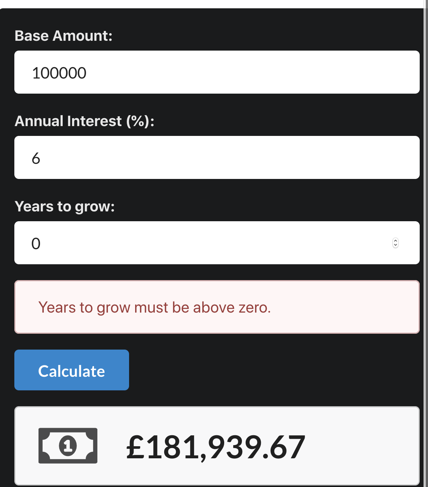

# Compound Interest Calculator

### Learning Objectives

- Practice building a front end React app using a backend API
- Recap testing on the back end (e.g. testing models)
- Practice front end validation and user messages
- Practice front end testing with react-testing-library

## MVP

- Complete the tests on the backend Calculator
- Build a front end to match the image above
- Display a message for the user if they enter "0" in the "Years to Grow" box. It should say "Years to grow must be above zero."
- Test the following:
  - Renders without crashing
  - Doesn't allow for 0 years growth
  - Displays a result with the £ sign when the Calculate button is clicked
  - Result is displayed in the correct NumberFormat (e.g £100,000.00)

## Extensions

- Display and test a message for the user if 0 is entered for the Base Amount and Annual Interest fields
- Extend the app (backend and frontend) to take a monthly contributions figure. You'll have to alter the backend calculation.

### HINTS

- Use the usual request_helper.js file for front end API requests
- For front end testing, create a Calculator.test.js file or create a **tests** directory
- To test that the result is displayed correctly, you'll have to use the `wait` method from react-testing-library and make the testing callback `async` (see an instructor for help)
